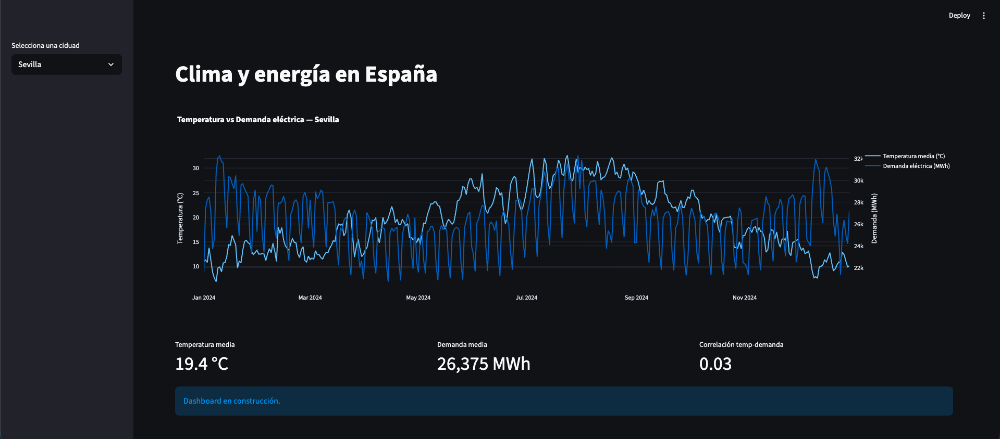

# Clima y energía en España



Pipeline de datos que cruza temperatura diaria (Open-Meteo) con demanda
eléctrica (Red Eléctrica de España / ESIOS) para varias ciudades españolas,
y un dashboard interactivo para explorar la relación entre ambas variables.

## Por qué este proyecto

La demanda eléctrica de un país varía con la temperatura (más calefacción
en invierno, más aire acondicionado en verano). Este proyecto extrae datos
reales de dos fuentes públicas, los limpia y cruza, y visualiza esa relación
mes a mes y ciudad a ciudad.

## Arquitectura

```
Open-Meteo API  ─┐
                  ├─► extract.py ─► transform.py ─► PostgreSQL ─► dashboard/app.py
ESIOS (REE) API ─┘
```

## Estructura del repo

```
clima-energia-espana/
├── README.md
├── requirements.txt
├── .env.example          # plantilla de variables de entorno (copiar a .env)
├── docker-compose.yml     # levanta PostgreSQL en local
├── src/
│   ├── extract.py         # llamadas a las APIs externas
│   ├── transform.py        # limpieza y cruce de datasets
│   ├── load.py             # carga en PostgreSQL
│   └── pipeline.py         # orquesta extract -> transform -> load
├── dashboard/
│   └── app.py              # dashboard en Streamlit
├── data/                    # datos crudos/procesados (no se sube a git)
└── notebooks/
    └── exploracion.ipynb    # análisis exploratorio (EDA)
```

## Setup

1. Clona el repo y entra en la carpeta.
2. Crea el entorno virtual e instala dependencias:
   ```bash
   python -m venv venv
   source venv/bin/activate
   pip install -r requirements.txt
   ```
3. Copia `.env.example` a `.env` y rellena tu token de ESIOS:
   ```bash
   cp .env.example .env
   ```
4. Levanta la base de datos:
   ```bash
   docker compose up -d
   ```
5. Ejecuta el pipeline:
   ```bash
   python -m src.pipeline
   ```
6. Lanza el dashboard:
   ```bash
   streamlit run dashboard/app.py
   ```

## Fuentes de datos

- **Open-Meteo** (https://open-meteo.com): API gratuita sin clave, datos
  meteorológicos históricos y de pronóstico.
- **ESIOS / Red Eléctrica de España** (https://www.esios.ree.es): API pública
  de demanda eléctrica, requiere token gratuito (registro inmediato).

## Estado del proyecto

✅ Completo — pipeline funcionando de extremo a extremo: extracción de
dos APIs reales, limpieza, cruce de datasets con distinta granularidad,
carga en PostgreSQL, y dashboard interactivo.
